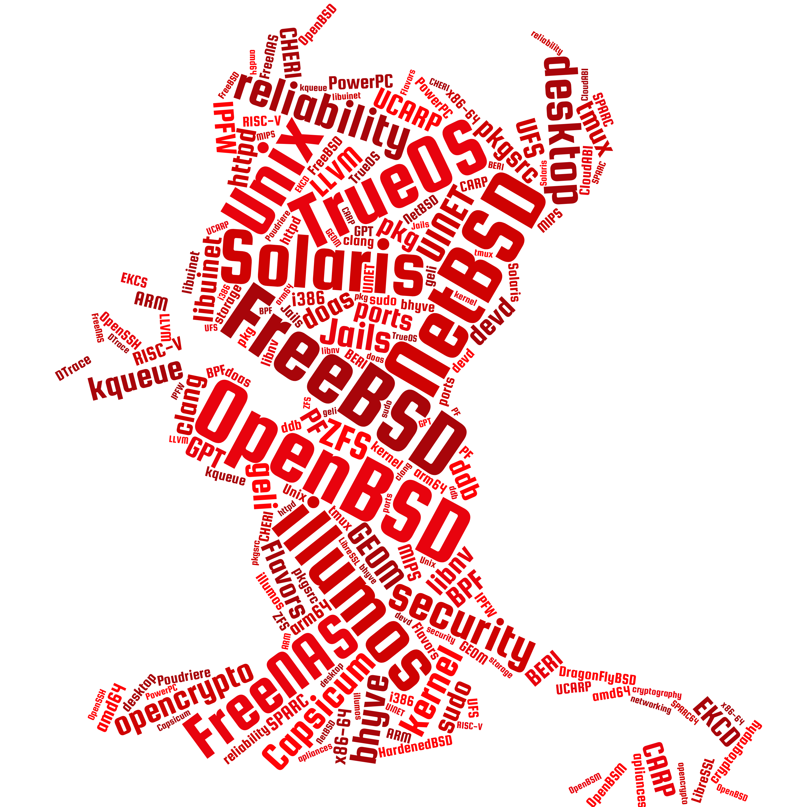

<h1>O nas</h1>

Grupa powstała z myślą o promowaniu systemów z rodziny BSD. Organizujemy spotkania, które zrzeszają miłośników systemów z rodziny Unix. Na spotkaniach prowadzimy prezentacje oraz otwarte dyskusje na tematy związane z systemami operacyjnymi. Zależy nam na tym, aby organizowane przez nas wydarzenia były interesujące dla każdego, kto interesuje się tematyką systemów operacyjnych oraz security. Każdy może mieć wpływ na tematykę prowadzonych prezentacji i dyskusji. Jesteśmy również otwarci na osoby, chcące opowiedzieć o dowolnie wybranym zagadnieniu dotyczącego systemów operacyjnych.

<h1>Najbliższe spotkanie</h1>

Kiedy:
<pre>
3 grudnia 2019 r.
18:15 - 21:00
</pre>
Gdzie:
<pre>
Fudo Security Office

Aleje Jerozolimskie 178
Warszawa
</pre>
O czym:
<pre style="white-space: pre-wrap;">
BSD Survival Guide
Adam Wołk, Konrad Witaszczyk, Mariusz Zaborski
</pre>

<a href="/registration">Rejestracja</a>

Do zobaczenia!

